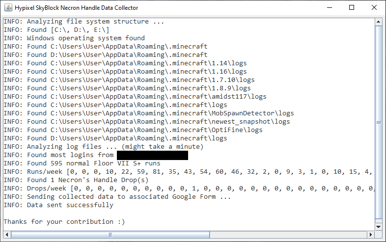

# Hypixel SkyBlock - RNG-Drops Data Collector
A tool that searches through Minecraft log files to collect data about the drop chance RNG-Drops in Hypixel SkyBlock and sends it to an accociated Google Form

(*Note: It was once called HypixelSkyBlockNecronHandleDataCollector, but with all the changes in v1.1.0 I renamed it*)

## Client-Side: Java Tool
### Where can I download it?
- [Download](https://github.com/doej1367/HypixelSkyBlockRNGDropsDataCollector/releases/download/v1.1.0/RNGDropsDataCollector.jar) (latest release)
    - It's the first .jar-file in [Realeases](https://github.com/doej1367/HypixelSkyBlockRNGDropsDataCollector/releases)
### What exactly does this app do?
1. Start the app. ([MainWindow.java#L134-L152](https://github.com/doej1367/HypixelSkyBlockRNGDropsDataCollector/blob/db3a82ce4fba00f011309f44838078bb39a3708d/src/main/MainWindow.java#L134-L152))
2. Show a small window to keep you up to date on what the app is doing. ([MainWindow.java#L42-L61](https://github.com/doej1367/HypixelSkyBlockRNGDropsDataCollector/blob/db3a82ce4fba00f011309f44838078bb39a3708d/src/main/MainWindow.java#L42-L61))
3. Get the roots of the local file systems like e.g. "C:\\" and "D:\\" for Windows or "/" for Mac/Linux and check what name your operating system has to determin where your minecraft folder is. For Windows this would be "%APPDATA%\\.minecraft", MacOS uses "\~/Library/Application Support/minecraft" and for Linux it's simply "\~/.minecraft". Once the minecraft folders are located the log folders are searched for. ([MainWindow.java#L65-L66](https://github.com/doej1367/HypixelSkyBlockRNGDropsDataCollector/blob/db3a82ce4fba00f011309f44838078bb39a3708d/src/main/MainWindow.java#L65-L66), [OSFileSystem.java](https://github.com/doej1367/HypixelSkyBlockRNGDropsDataCollector/blob/db3a82ce4fba00f011309f44838078bb39a3708d/src/util/OSFileSystem.java) and [OSName.java](https://github.com/doej1367/HypixelSkyBlockRNGDropsDataCollector/blob/db3a82ce4fba00f011309f44838078bb39a3708d/src/util/OSName.java))
4. Once the "logs" folders are found, the actual parsing and data extraction of the chat messages from all those dungeon runs and slayers, etc. can begin. ([MainWindow.java#L69-L97](https://github.com/doej1367/HypixelSkyBlockRNGDropsDataCollector/blob/db3a82ce4fba00f011309f44838078bb39a3708d/src/main/MainWindow.java#L69-L97), [MCLogFile.java](https://github.com/doej1367/HypixelSkyBlockRNGDropsDataCollector/blob/db3a82ce4fba00f011309f44838078bb39a3708d/src/util/MCLogFile.java), [MCLogLine.java](https://github.com/doej1367/HypixelSkyBlockRNGDropsDataCollector/blob/db3a82ce4fba00f011309f44838078bb39a3708d/src/util/MCLogLine.java), [LogRecords.java](https://github.com/doej1367/HypixelSkyBlockRNGDropsDataCollector/blob/db3a82ce4fba00f011309f44838078bb39a3708d/src/util/LogRecords.java) and [TimeslotMap.java](https://github.com/doej1367/HypixelSkyBlockRNGDropsDataCollector/blob/db3a82ce4fba00f011309f44838078bb39a3708d/src/util/TimeslotMap.java))
5. Now that we have the data we need, the final step is to send it to the Google Form, so that it can be summed up and processed together with all those other submissions in the to forms connected Google Sheet. ([MainWindow.java#L100-L128](https://github.com/doej1367/HypixelSkyBlockRNGDropsDataCollector/blob/db3a82ce4fba00f011309f44838078bb39a3708d/src/main/MainWindow.java#L100-L128), [GoogleFormApi.java](https://github.com/doej1367/HypixelSkyBlockRNGDropsDataCollector/blob/db3a82ce4fba00f011309f44838078bb39a3708d/src/util/GoogleFormApi.java))
6. Thats it. You can now close the app. If you want to you can also delete the jar-file or start the app again to submit a new and updated response.

    

  

## Server-Side: Google-Forms / Google-Sheets
- Submitted automatically on successful log file analysis
- [Results as Google Sheets Graphic](https://docs.google.com/spreadsheets/d/e/2PACX-1vReIuER28dXhxg4nQA-9RasMRvrXXb14EZdMTEmccgl-ACaybZ1nYHQVauiW9S08nWOOawyQ48P4HU0/pubhtml)
